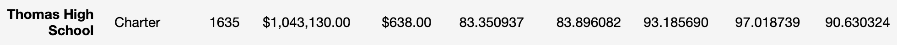
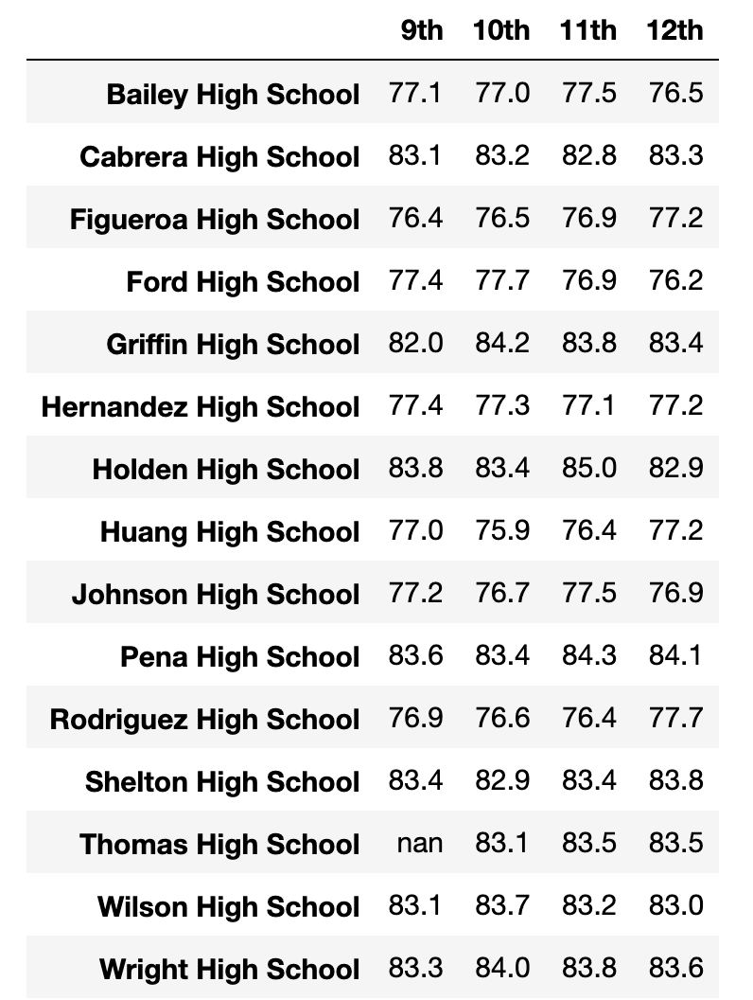

# School District Analysis
Analysis of grades from various school districts

## Overview
The purpose of this analysis was to provide school board members with various comparison metrics in order to make budgetary decisions regarding the upcoming school year. General metrics at the district level are presented along with analyses by school with math and reading averages, spending per student and passing rates. Tables are also presented for the top-performing schools as well as scores by grade, average spending, school size and type of school. Due to suspected impropriety, the reading and math scores for the 9th grade students of Thomas High School have been nullified and the analysis has been reworked to accomodate the changes.

## Results

After the rework of the analysis, the district summary was largely unaffected. The small population of students had negligible effect on the metrics of the broader district. In the analysis by school, Thomas High School's average reading score dropped slightly while the average math score rose slightly. The passing percentages dropped across the board, the most significant change being the overall passing rate, which dropped by just over .3 percentage points. The number for pre and post rework are displayed below. Despite the meager drop, Thomas remains the second highest performing school in the district, outperformed only by Cabrera High School with a 91.3% passing rate.

The deletions largely did not effect the sub anhalyses as they were too broad to be impacted by such a small subset of students. The exception, of course, being the breakdown of scores by grade. The 9th grade Thomas High School Students had no value for the math and reading scores as shown in this image.

## Summary

The broad conclusions of the analysis were barely changed by the removal of the 9th grade Thomas High School scores. However, several changes had to be made to the process of producing the analysis.
  * The total student count had to be reduced in order to maintain consistency with the average calculations. The actual number of students across all districts is 39,170 but the number used in calculations was 38,709.
  * Once the grades were removed, the passing percentages for Thomas High School had to be calculated in isolation, then reinserted into the school breakdown table manually.
  * As mentioned above, the average scores and passing percentages were slightly effected by this change.
  * The breakdown by grade level could not be honestly compared as the 9th grade students at Thomas displayed no grades in the table.
